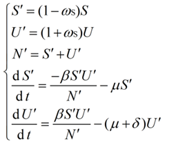
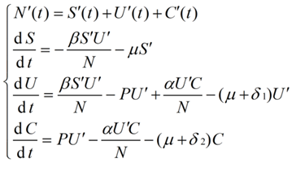

[TOC]

全文共约6790字，读完需花费约10分钟

------

# 美赛经验分享

## 杂谈

大家好，我叫徐冠宇，是2017级徐特立学院信息方向的一名本科生。非常荣幸能给大家分享美赛的经验。回顾自己过去三年的竞赛经历，可以说和数学建模结下了不解之缘，大一下学期的校赛，大二上学期的国赛，大二寒假的美赛，大二下学期的校赛，大三上学期的国赛，还有即将到来的2020年美赛。尽管参加了这么多次的数学建模，但也没获得过很好的奖项，我无法说看了这篇文章，大家一定能获得奖项，只是希望自己通过多次比赛总结出来的经验教训，能让大家对美赛有个更清楚的认识，少走弯路。因为美赛与我们参与的绝大多数比赛都不太一样，它是英文撰写论文（相信大部分同学都还是第一次用英文写科技论文），而且赛题也与咱们中国建模比赛的风格截然不同，这些我都会在下面向大家详细阐述。废话不多说，我们开始进入正题。

## 美赛题型分析

[美国大学生数学建模竞赛](https://www.comap.com/undergraduate/contests/)*（MCM/ICM）*，简称美赛，关于由什么组织举办，有什么奖项等基本的介绍在官网和[百科](https://baike.baidu.com/item/%E7%BE%8E%E5%9B%BD%E5%A4%A7%E5%AD%A6%E7%94%9F%E6%95%B0%E5%AD%A6%E5%BB%BA%E6%A8%A1%E7%AB%9E%E8%B5%9B/8324806?fr=aladdin)说的很清楚，大家自己看看就行。下面我将重点说明下美赛题型。

### MCM/ICM区别

在说题型前，不得不先讲下MCM和ICM的区别，或许能先帮助大家对于赛题有个大致的把握。MCM（Mathematical Contest in Modeling）译为数学建模竞赛，ICM（The Interdisciplinary Contest in Modeling）译为交叉学科建模竞赛，这两个比赛都属于美赛，这两者无论是比赛时间还是公布成绩的形式等都相同，只有题型不一样。而美赛共有A-F 6道题，其中A-C题属于MCM，D-F属于ICM，从两个竞赛的名字，我们可以大概了解到两者的区别。其实，两者的出题风格有很大的差异，MCM竞赛的题目更加具体，表述简洁，要求明确，有些题目会以美国生活习惯为背景，导致我们中国学生很不熟悉，而ICM竞赛题目更开放，问题更宏观，会涉及世界国家的热点问题，因此不依赖特定的文化背景或生活习惯。但也正由于ICM赛题更加开放，导致有时大家很难想到该如何进行建模，尤其是E和F题，经常被大家称为~~“语文建模”、“玄学建模”~~（\滑稽 ），也导致了为什么有人说即便是建模小白也能拿美赛O奖。

*而在获奖率方面，虽然官方没有明确说明，但就往年数据来看，ICM获奖率还是要比MCM高。这里有份官方公布的[16年获奖数据](https://www.comap.com/undergraduate/contests/mcm/contests/2016/results/)，大家可以看看。不过，这并不是说大家都去选ICM，这个在后面我会再说明。*

### 各题目说明及选题建议

 

美赛题型

下面详细说说6道题各自的特点（这只能说是个人猜测，无法保证说2020赛题与我说的一定符合），A和B题官方的解释是连续和离散类型，但这实在是太广泛了，几乎涵盖了所有类型，和没说没什么区别。而根据我个人经验来看，A和B题多为**优化、预测**、分配类型的题目，而且有时还会涉及物理类的题目，如下图16年美赛A、B题所示，A题讲的是一个关于热传导的问题（18年的国赛A题与它比较类似，~~注意两者的时间~~），希望选手设计一个能可能保持水温的浴缸，这正是这道题才传出了~~建模不会问某宝客服的佳话~~（每年美赛都会有很多的趣事，大家有兴趣可以搜一搜）。而B题则是设计太空垃圾的回收方案，让成本最低。从这两题可以看出，A和B题要求非常清晰，模型类别也很明确，建模初期都能有一个大致的方向，这也说明在阅卷时，你的结果要与答案有较高的吻合度，才能获得比较好的奖项。

 

16年美赛a、b题

 

某宝客服帮你建模\滑稽

对于C题，是在2016年新增加的，为此官方专门写了一篇[doc](https://www.comap.com/undergraduate/contests/mcm/flyer/MCM-Problem-C-Overview.pdf)来说明。据我猜测，主要是因为最近几年大数据太过火热，所以出了这么一道题（不过这也说明了大数据在当今时代的重要性）。这题会附带数据的压缩包，选手需要掌握数据分析的基本方法，如预处理，数据清洗，数据建模，优化等，因此仅仅掌握MATLAB的使用可能还不太够，还需要掌握SPSS、scikit-learn等专业软件或框架的使用，主要方法涉及统计分析、神经网络等。

至于D题，相比于A和B题，特点就比较明显，主要与网络科学、运筹学、信息科学相关，也是近几年比较热门的研究方向，这在搜集资料方面是一个优势，主要的建模方法包括神经网络、模式识别博弈论等，如果有这方面知识背景的同学，可以优先考虑。

E和F题主要与环境和政策相关，涉及当今世界各国的热点问题，在做这两题时，需要从大局考虑，站在一个领导者的角度，对某个国家，甚至世界政策进行改进或者制定，这就导致建模时比较难找到一些具体的模型，但至少能保证有话可说，做到言之有理即可，这也是为什么有人说是~~“语文建模”~~。选择做这两题时，比较容易获奖，但比较难获得好的奖项，大家选题时可以多多斟酌下。

最后，关于选题方面，总结一下，如果大家**数理基础**较好的，推荐选A和B题；如果大家懂得**数据分析**的相关软件和算法，推荐选C题；如果有**网络科学、运筹学**、信息科学等知识背景的，推荐选D题；如果**文笔**较佳（当然文笔好对于任何题都很有帮助），对于**环境和政策**方面了解多的，擅于政策制定，推荐选E和F题。

### 特殊

这里还有一点需要单独说明，美赛有一个地方与其他建模比赛不同，之前我附上了16年美赛的A和B题的题目，有个地方不知道大家注意到没有，美赛经常会要求选手提交一份规定字数的技术说明或总结报告一类的东西（我在下图中用红线标出），千万注意，**这个和摘要不是一回事**，千万别漏了，要求方面题目中都会给出具体的说明，只要认真写，问题不大。

 

美赛特殊之处

## 知识储备

### 常用模型

首先，掌握常用的模型，我画了一张mindmap（如下图所示），稍微总结了下常用的模型（我临时想的，不保证全，但如果能都掌握，也是相当不错了）。如果由于时间紧无法都掌握，最好先保证每个算法都能找到相关的教程和源代码，这样到时候临时查阅也来得及。

 

常见模型

### 编程语言&专业软件

其次，掌握以下至少2种编程语言或专业软件的使用（排名有先后）

- 编程语言：MATLAB、C/C++、Python、R等
- 数学软件：MATLAB（软件还是语言不好区分）、SPSS（统计分析）、Lingo（优化）、Mathematics（推导）等
- 绘图：PPT、Visio（流程图）、Python、Photoshop等
- 论文编辑器：Latex、Word
- 数据可视化：MATLAB、Excel、Python、R等
- 文献管理（非必须）：Endnote、Mendely

我主要说说其中几个软件，一定要会用MATLAB！一定要会用MATLAB！一定要会用MATLAB！重要的事情说三遍，MATLAB是一个无比强大的软件，它基本可以完成95%的工作，只有少数较为特殊的功能才需要用到其他软件，而且用好了MATLAB，对于大家以后的科研学习都是有非常非常大的帮助的，大家以后一定可以体会到。

绘图方面，优先推荐PPT，有一说一，PPT绘图方面实在是太方便了，90%的图像完全都可以用它绘制，我的大部分科研用的图形也是用它画的，而Photoshop的确啥都能画，但过大，不是很方便。

论文编辑器方面，我只能说Latex排版它不香吗？公式编辑它不香吗？表格制作它不香吗？尽管需要些编程知识，但对于它强大的排版功能来说，简单的编程其实完全可以忽略了，当然也并不是说Word排版不好，不用Latex就获得不了好的奖项，我第一次美赛用的也是Word，Word胜在简洁、易上手，如果大家有时间的话，还是非常推荐大家用Latex，因为在之后写论文的时候，用的都是Latex进行排版。记得赛前要准备好Latex或Word的论文模板

数据可视化方面，MATLAB和Excel基本的也够用了，不过他们毕竟不是特别专业，这时候不得不说下python了，大家注意到没有，我推荐的东西里面，除了MATLAB，Python是出现的最多的一个，其实Python由于它包含海量的第三方库，通过调库，可以十分方便的实现各种功能，导致其风靡一时，无人能望其项背，~~几乎可以说Python是最好的语言（\滑稽 保命）~~。以上提到的各个软件其实都可以由Python替代，他们都有各自的第三方库与之匹配，到时候直接调用即可，但不得不说的是，Python的运行效率不高，在一些讲究运行效率的场合，是完全无法与其他专业软件媲美的，这个时候更推荐大家用C/C++进行编程。

### 英文科技论文撰写能力

第三，要有一定的英文科技论文撰写能力，对于大家来说，可能不是第一次写科技论文，但对绝大多数人来说，会是第一次撰写英文科技论文。写英文论文与我们以往写中文论文是非常不一样的，西方人的写作习惯、思维习惯可以说和我们中国人是截然不同，对于格式、用语也有着很明确的要求，不过由于我个人英语不是特别好，担心自己可能说的不是很好，所以有些具体的内容我就不在这里展开了，不过我的建议是最好和队友翻译下自己以往的建模论文或者找一篇优秀的国赛论文进行翻译，然后给指导老师看看，写作技巧方面，大家可以上知乎搜一搜（关键词：英文科技论文），上面有很多这方面的帖子，大家可以参考参考，最好能提炼出一些常用语。

最后，总结下

> 比赛必备：
>
> - 一本关于各种常见模型的书
> - 一本MATLAB常用代码的书
> - Latex或Word论文模板
> - 英语科技论文常用短语
> - 编程语言：MATLAB、C/C++（MATLAB必须掌握）
> - 论文编辑器：Latex或Word

## 时间节点安排

时间节点，我以自己参加19年美赛的时间安排为例，进行说明，仅供大家参考。

> 2019年美赛比赛时间为北京时间2019年1月25日早上6:00（美国东部时间1月24日17:00）至2019年1月29日09:00（美国东部时间1月28日20:00）。

- 比赛前1-2个月，熟悉常用模型，编写常用代码，制作论文模板
- 1月18日-1月22日使用16年赛题进行模拟赛
- 1月25日上午12点前，分析各题目，决定选择C题
- 1月25日晚上11点前，查阅本题相关文献
- 1月26日，建立基本的模型框架，基本完成题目第一问
- 1月27日，发现模型bug，修正模型，完成第一问和第二问部分
- 1月28日-1月29日 凌晨1点，完成题目各小问
- 1月29日凌晨1点至4点，摘要撰写，论文润色，完成收尾工作，提交论文。

我给大家梳理下时间节点，首先，建议大家赛前1-2星期，进行下模拟赛，如果时间不够的话（emmm我写帖子时已经是二月份了），可以翻译下自己写的建模论文，或者国赛的优秀论文，然后给指导老师看看，这样会有很多的帮助。比赛的第一个半天时间，一定要好好审题，翻译不要去看网上的那些版本，都是机翻的，大家要相信自己的实力（我英语这么差都可以自己翻，你们还怕什么），不确定的话，可以用[Google翻译](https://translate.google.cn/)，还支持上传文件翻译。**每一题都要查阅资料**，都过一遍，不要觉得这道题很有把握，后面的题就不看了，很有可能做到后面的时候突然熄火，思路卡住，如果时间来得及的话可以考虑换一道题，但千万千万注意，**不到万不得已，不要换题！不到万不得已，不要换题！不到万不得已，不要换题！**重要的事说3遍。如果到了第三天还想换题的话，建议还是算了吧，这样基本很难写完。

之后基本一天完成1/3，最后进行论文润色和收尾，这样时间安排是比较合理的，但大家可以看到，其实我中途是出现了问题的，导致后面的进度一直比较赶，主要是因为看之前审题不够细致，导致出现了问题，而且由于是C题，数据量比较大，处理起来耗费了蛮多的时间。

最后，有个提交论文的细节提醒下大家，能凌晨提交就不要拖到早上了，基本在29日凌晨就有很多人提交论文了，大家最好不要用校园网提交，网络很差，直接用流量开热点（不过今年情况比较特殊，不知道什么时候开学，所以也不太好说），当时有些同学一直到早上8点半都没提交成功。

## 19年美赛回顾

这一部分，主要给大家讲讲我当时美赛的心路历程。

19年C题

> C题问题描述：
>
> 由于题目很长，我就只截取部分，具体题目大家可以搜一下，这里我给大家简要说明下，问题背景是近几年美国阿片类药物使用泛滥，导致药物成瘾比例急剧增加，问题一是我们需要通过提供的2010-2016年阿片类药物数据集，建立模型来说明五个states及其counties阿片类药物的传播特征，并找出最可能源自于什么五个州的地方。如果按照我们的模型，美国会存在什么问题？并说明发生这些问题的药物阈值水平，并预测未来什么时候发生在什么地方？
>
> 问题二是问是什么因素导致了阿片类药物的使用增长？尽管已经知道使用阿片类药物的危险，仍旧使用？使用药物趋势与美国社会经济因素有关吗？如果是，请修改第一部分模型。
>
> 问题三是找到应对阿片类药物滥用的策略，并使用模型检测策略的有效性，确定相关的参数阈值。

我们先从题目本身分析一下，每一部分，有很多个问题，单part1就有5个问题，每一个问题都问的非常细节，而且问题之间都有着很强的关联性，而且还有一点，也是美赛的特别之处，它不单单是要求你求出某个结果，还需要你**制定出相应的方案**，并验证方案的**合理性**，并**预测**该方案可能产生的结果。其实，这和一些数据分析师的实际工作流程非常类似：通过获得的数据，进行建模，特征提取，分析数据，制定方案，验证方案的可行性，预测未来结果。与我们题目要求非常吻合。

然后，我们开始从建模角度进行分析，因为C题是提供了数据的，我们只需要从这些数据中进行分析即可，找到可能会影响药物传播的因素，比较简单的方法是通过各个因素的权重进行分析，如熵权法，其他提升的方法比如层次分析法、灰色关联分析法等。另外一种思路是，药物成瘾的传播可能存在一定的“传染性”（影响周围的人也服用阿片类药物），联想到传染病模型，进行相应的修正，经过回归分析，进行参数拟合，建立最终模型。

以上是我最初看到这道题的思路，之后就开始查阅相关的资料和论文。

查资料的时候，有些建议给大家。**不要用百度！不要用百度！不要用百度！**重要的事情说三遍。百度说实话现在是越来越不行，更不要说英文搜索方面了，强力推荐大家用Google，无法~~科学上网~~的同学，可以用Google镜像，网上搜一下有很多，实在用不了可以用Bing。搜索中文论文其实万方知网还算凑合，英文论文推荐大家用[ScienceDirect](https://www.sciencedirect.com/)或[ResearchGate](https://www.researchgate.net/)（可以用学校邮箱注册），基本大部分文章都可以搜到，还有要提醒大家的是要充分利用学校的数据库，最近学校发了一篇[推送](https://mp.weixin.qq.com/s/CNOzy52DbFfD1WWrIIuZ7Q)，教大家怎么用，可以详细看看。

> 通过查阅资料发现，有科学报告指出，毒品滥用的传播过程可以与传染病传播类似的方式进行建模，原因为：
>
> - **Opioid drugs are infectious.** One opioids user can easily induce others to pick up bad habit and become highly addicted. If we don’t take measures, the harm of opioids grows more obvious as longer time goes on.
> - **Opioids overdoes is spread through exposure like most infectious disease.**

根据传染病模型建立差分方程组如下所示

> 参数说明：
>
> - S：某一年，未使用阿片类药物人数
> - U：某一年，阿片类药物成瘾人数
> - N=S+U
> - β：每年一个阿片类药物成瘾者感染的平均人数
> - μ：自然死亡率
> - δ：戒瘾率（每年戒除阿片类药物成瘾占总成瘾人数的百分比，也可理解为治疗成功率）

之后就是参数拟合，不知道大家注意到一点没有，其实在这个地方模型出了问题，因为part1最后要求*“identify **any possible locations where** specific opioid use might have started in each of the five states.”*但这个模型中，是完全没有考虑地点这个因素的，因此在第三天时间紧急的情况下，综合分析2010年至2016年药物使用分布情况，新定义了一个参数Ro，定义为β与μ+δ的比值，用于反映阿片类药物的成瘾程度，哪个地区Ro值越大，则说明该地越有可能是发源地之一。
$$
R_0=\frac{\beta}{\mu+\delta}
$$

> The values of *R*o reflect the epidemic and addictive levels of using opioid drugs. The bigger the *R*o , the earliest the specific opioid use may have started in each of
> the five states.

> *下图是由python绘制的2010和2016年阿片类药物使用分布情况，由于当时python玩的不是很溜，而且时间比较紧，所以做的不是很好。放出来主要是想说明python在绘制一些特殊图表时的优势。*

2010和2016年阿片类药物分布情况

对于药物阈值水平，由于并没有查询到相关的文献对这一参数进行说明，于是考虑自己定义。我们可以很容易从逻辑上可知药物阈值水平与Ro和最大阿片类药物成瘾人数成反比，比例系数简化起见设为1，再根据之前建立的模型，即可求得预测最有可能未来什么时候发生在什么地方。

问题二，由于题目要求从美国社会经济调查数据入手，而经过分析发现总共有近600条影响因素，每一条单独分析工作量未免太大，因此，考虑采用主成分分析法和独立性权系数法，筛选出影响程度最大的十个因素，求出各自的权重系数 ωs，加入到上一部分的模型中，进行修改，得到修正后的模型，如下所示

再进行拟合，找出拟合程度最高的曲线对应的影响因素，说明美国社会经济因素对药物成瘾的影响即可。

问题三，制定策略，这一块就比较开放，我记得美国有些卫生组织提过一些关于毒品成瘾的应对措施，以下是想到的策略。

> strategy:
>
> - Isolation Treatment
> - Non-opioid Substance Treatment
> - Encouraging scientific researchers and drug manufacturers to develop abuse-resistant opioid product.
> - Educating medical staff and the public about the harmful effects of misuse, abuse and overuse of opioid drugs.
> - Governments should formulate, evaluate and promote policies and programme to prevent and treat prescription opioids abuse to ensure that pain patients receive safe and effective treatment.
> - Carrying out the FDA Opioids Action Plan and running the Prescription Drug Monitoring Programs.

由于时间紧，主要对策略一进行验证。根据策略一，将之前模型再进行修正，考虑加入隔离治疗人群C，模型如下

> 参数说明：
>
> - C ：被隔离治疗人数
> - P：每年送去治疗的人数占总成瘾人数比例
> - α：治疗后，仍旧上瘾的人数比
> - δ1：自主戒瘾率（凭借个人毅力戒毒瘾）
> - δ2：治疗戒瘾率

拟合后发现效果不错，并且上瘾人数稳定下降，说明该措施效果较好。

总结一下，通过我以上讲的，其实大家可以发现模型并不复杂，并没有用到什么高大上的东西，只要把模型叙述清楚，各个细节都考虑到就可以了，这也是现在建模比赛的一个趋势。还有一点要说是，美赛相较于国赛，更突出创新性（当然先要做到把基本的做好，不然再创新也没用），如果以上都能做到基本能获得相当不错的奖项了。

最后，预祝大家美赛都拿O奖！